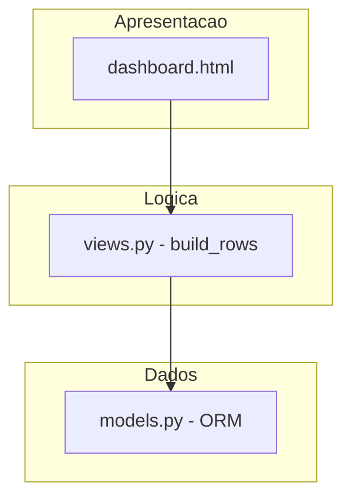
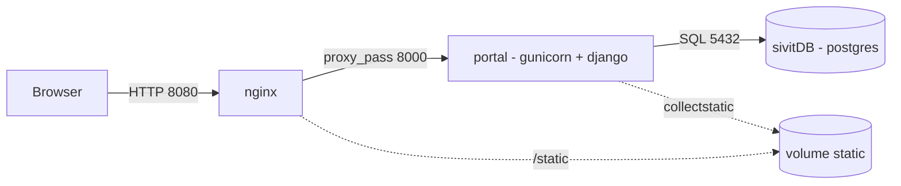

# Arquitetura SIVIT (TP2)

## Diagrama de software

```mermaid
flowchart TB
  subgraph Apresentacao
    T[dashboard.html]
  end
  subgraph Logica
    V[views.py - build_rows]
  end
  subgraph Dados
    M[models.py - ORM]
  end
  T --> V --> M
```

## Diagrama de sistema

```mermaid
flowchart LR
  U[Browser] -->|HTTP 8080| N[nginx]
  N -->|proxy_pass 8000| P[portal - gunicorn + django]
  P -->|SQL 5432| D[(sivitDB - postgres)]
  N -.->|/static| S[(volume static)]
  P -.->|collectstatic| S
```
